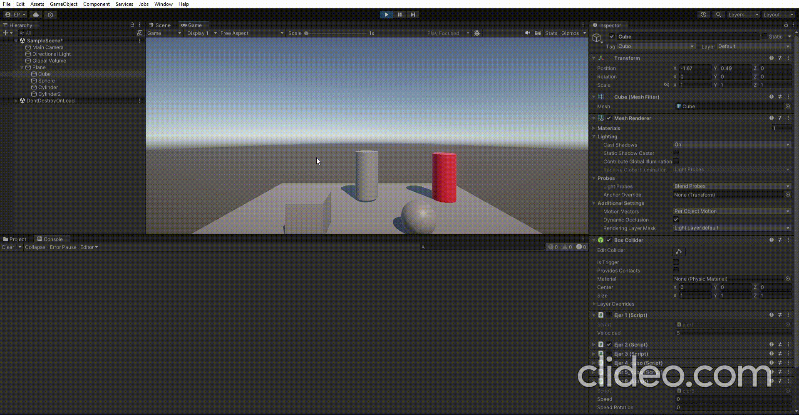
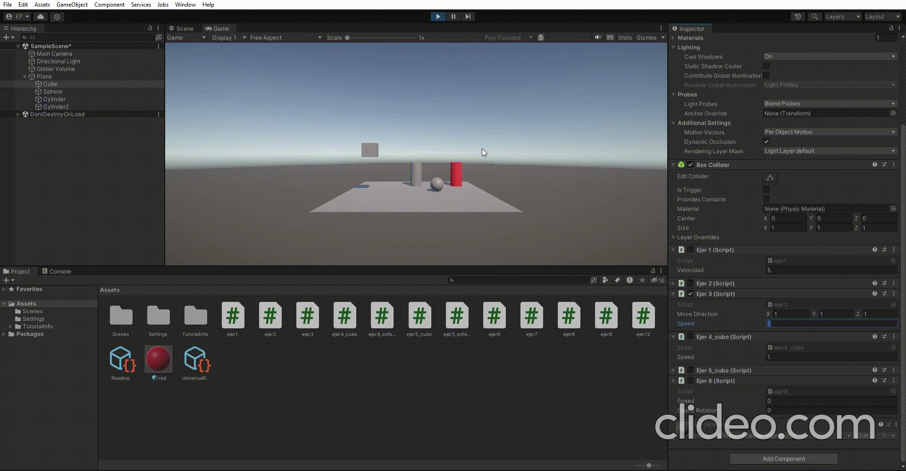
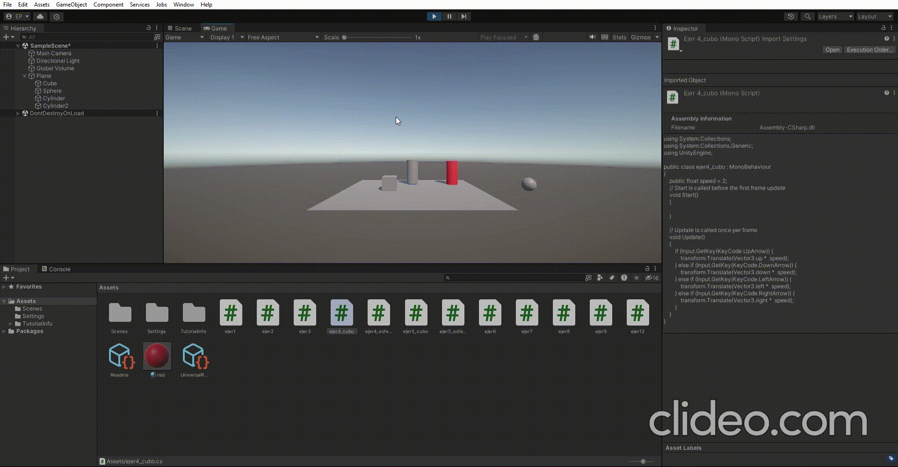
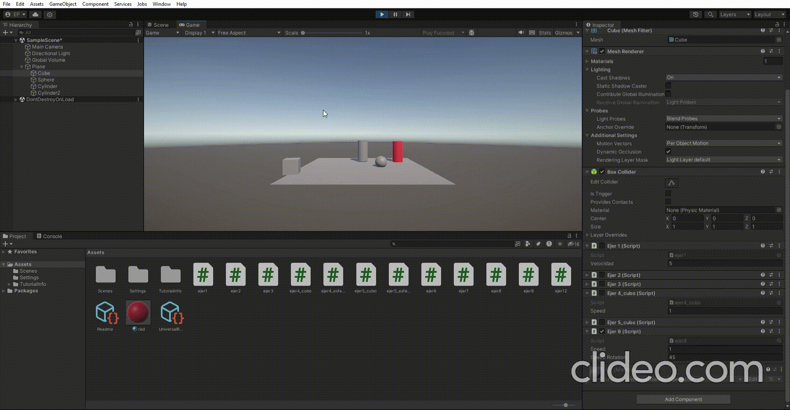
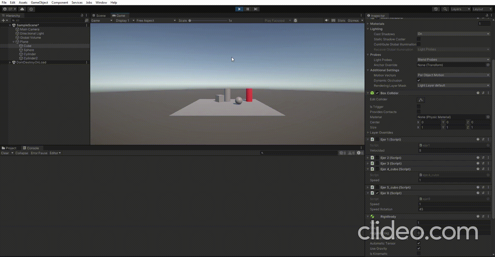
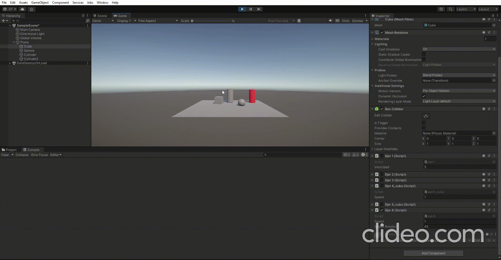
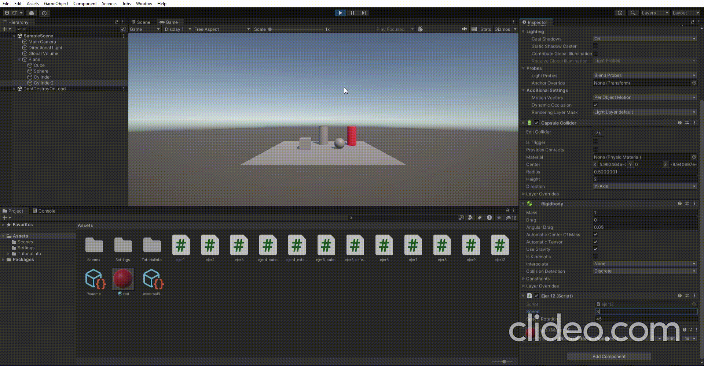

# pr3_interfaces_inteligentes
## En esta practica se han realizados escenas en las que practicamos C# y fisicas en unity:
### ejer1: multiplicar la velocidad por el eje vertical/horizontal

### ejer2: mapear la tecla H

### ejer3: mover el cubo, 
### duplicar las coordenadas de la direccion del movimiento: desplaza mas rapido
### duplicar la velocidad: se desplaza mas rapido
### si la velocidas en 0 no se mueve y si es negativa se mueve en sentido contrario
### si y > 0 entonces realiza el movimeinto desde mayor altura
### movimiento respecto al sistema local de coordenadas
### respecto al sistema de coordenadas del mundo

### ejer4: mover el cubo y la esfera con el teclado

### ejer5: mover el cubo y la esfera pero adaptado a los frames

### ejer6: que el cubo se mueva hacia la esfera

### ejer7: mover el cubo y mire a la esfera

### ejer8: girar el cubo o que avance siempre hacia delante

### ejer 9/10: mostrar por consola si un objeto colisiona con el cilindro o la esfera

### ejer11: colision pero con trigger

### ejer12: probar colisiones con diferentes tamaños de masa
### para una masa de la esfera 10 veces mayor el cilindro no es capaz de moverla, para 10 veces menor la desplaza facilmente y para la friccion

