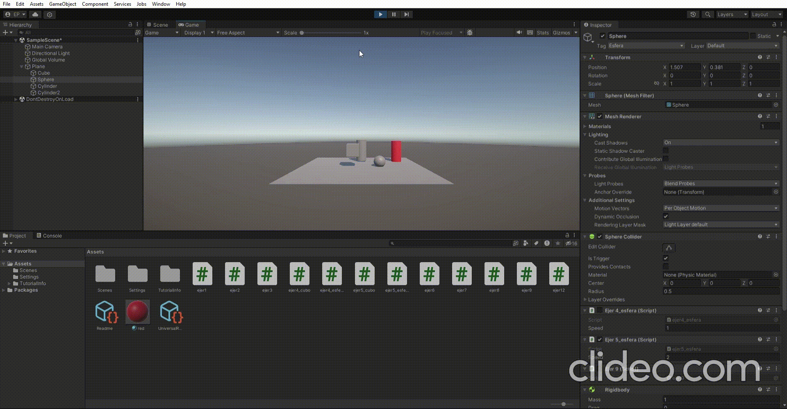

# pr3_interfaces_inteligentes
## En esta practica se han realizados escenas en las que practicamos C#:
### ejer1: cambiar un cubo de posicion

### ejer2: mostrar los nombres de los objetos en escena

### ejer3: mostrar operaciones sobre vectores

### ejer4: mostrar posicion de la esfera

### ejer5: distancia de el cubo y cilindro a la esfera

### ejer6: Alinear la esfera, cubo y cilindro

### ejer7: cambiar los colores al cilindro y a la esfera

### ejer8: elevar la esfera mas cercana al cubo y cambiar de color la mas alejada 
## esta puesto a que haga el calculo en la funcion start para que ambas esferas no se eleven

